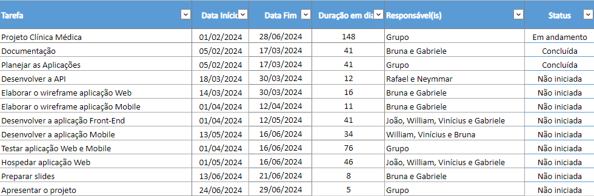
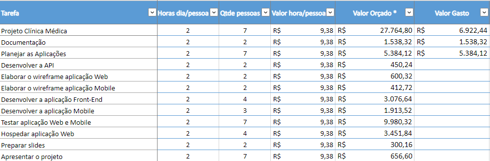
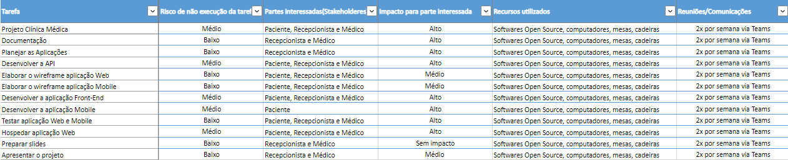
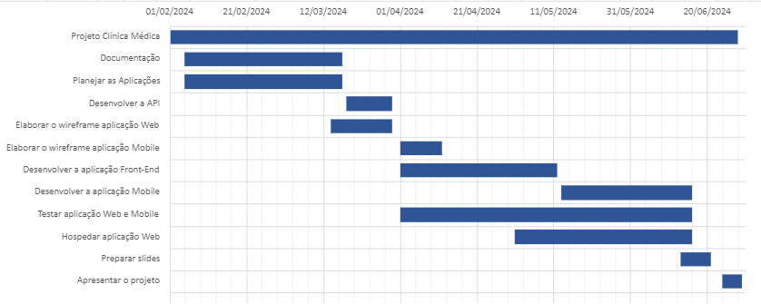
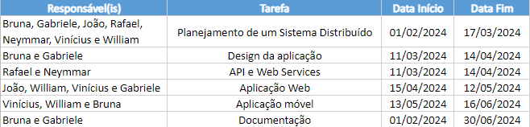
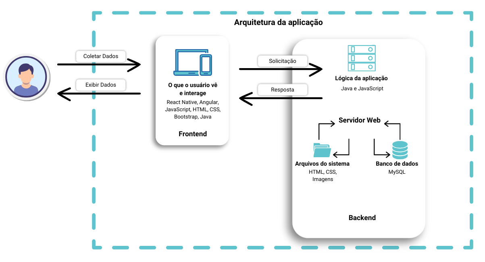

# Introdução

Nos últimos anos, tem ocorrido um aumento significativo na demanda por soluções tecnológicas eficientes na área da saúde, visando melhorar a qualidade dos serviços prestados, a eficiência operacional e a experiência dos pacientes. Atualmente, muitas clínicas enfrentam dificuldades na organização de agendas, no controle de prontuários, na comunicação eficiente entre equipe médica e administrativa, e na análise de dados para tomada de decisões estratégicas. Além disso, a crescente demanda por serviços de saúde requer uma abordagem mais ágil e eficiente na prestação de atendimento aos pacientes. 

Determinamos como objetivo deste projeto, desenvolver um sistema distribuído que integre e automatize os processos de gestão de pequenas clínicas médicas, proporcionando uma solução abrangente que melhore a eficiência operacional, otimize o fluxo de trabalho e promova uma experiência mais satisfatória para pacientes e profissionais de saúde. Ao alavancar as tecnologias mais recentes em sistemas distribuídos, como computação em nuvem e arquitetura de microsserviços, pretendemos oferecer uma plataforma escalável, flexível e confiável que atenda às necessidades específicas de pequenas clínicas de diferentes especialidades médicas. 

## Problema
A referente aplicação busca resolver os problemas relacionados à eficiência operacional e gestão de pacientes e consultas, proporcionando uma solução abrangente e integrada para melhorar a qualidade dos serviços de saúde oferecidos por quem há utilizar, podendo ser pequenas clínicas médicas, incluindo consultórios individuais, clínicas especializadas e centros de saúde com uma equipe médica limitada.

## Objetivos

O objetivo geral do trabalho consiste desenvolver um sistema web para a gestão de consultas médicas, desde o agendamento até o prontuário médico eletrônico, a API para troca de informações e aplicação Mobile para os pacientes, possibilitando o agendamento de consultas e acompanhamento de prontuários pelo celular visando melhoria nos serviços prestados pelas clínicas que o utilizarem. 
 
## Objetivos específicos
* O paciente poderá fazer o seu próprio cadastro, agendar, alterar e cancelar consultas médicas e visualizar seu prontuário, através de sistema Web e aplicação Mobile; 
* A Recepcionista poderá cadastrar, alterar e excluir pacientes, médicos e usuários no sistema; gerenciar consultórios, agendas de médicos e pacientes; visualizar relatórios de agendamentos, pacientes, médicos utilizando a aplicação web; 
* Os médicos poderão realizar consultas, cadastros, alterações e exclusão de prontuário de seus pacientes utilizando a aplicação web;
* Todos os usuários do sistema terão acesso a página de login, logout e troca de senha através de aplicação mobile e web.

## Justificativa

Pequenas clínicas médicas frequentemente enfrentam desafios significativos na organização e gerenciamento de suas operações diárias, devido a recursos limitados e processos manuais muitas vezes complexos e propensos a erros. Nesse contexto, o desenvolvimento de uma aplicação para a gestão dessas clínicas médicas não apenas atende às necessidades específicas dessas organizações, mas também representa um investimento inteligente na melhoria dos cuidados de saúde, na satisfação dos pacientes e na sustentabilidade do negócio.

## Público-Alvo

O vigente projeto busca atender há pequenas clínicas médicas de até 10 médicos, que necessitam do melhor gerenciamento interno de consultas, clientes, agendamentos e prontuários, visando facilitar desde o momento do agendamento das consultas por parte do paciente, ao momento de consulta de disponibilidade da agenda para o funcionário ou administrador, tendo como meta melhorar de forma geral os serviços prestados.

# Especificações do Projeto

Com a constante evolução da prestação de serviços de saúde, a incorporação de tecnologia e inovação tornou-se uma necessidade premente para clínicas médicas de todos os tamanhos. O atual projeto visa desenvolver uma aplicação para otimizar o agendamento de consultas e a gestão tanto de consultas quanto de pacientes, melhorando assim a eficiência e a produtividade de pequenas clínicas médicas. O desenvolvimento dessa aplicação será conduzido levando em consideração as necessidades das clínicas, buscando sempre aprimorar a qualidade dos serviços oferecidos e proporcionar uma melhor experiência aos envolvidos. 

## Personas
### Persona 1 – Administrador 

Marcos Oliveira tem 40 anos, é um ortopedista bem-sucedido que administra sua própria clínica. Ele é apaixonado por seu trabalho e dedicado ao cuidado de seus pacientes. Além de seu compromisso com a medicina, Marcos também se interessa por tecnologia e busca maneiras de melhorar a eficiência e a qualidade dos serviços oferecidos em sua clínica. 
Ele busca uma aplicação web que o ajude a gerenciar o agendamento de consultas e prontuários de seus pacientes, melhorar a eficiência e a produtividade de sua equipe, minimizando o tempo gasto em tarefas administrativas. 

### Persona 2 – Administrador 

Rodrigo Campos tem 46 anos, dono de uma clínica odontológica, casado, possui 3 filhos. Têm uma agenda muito corrida e concorrida pelos seus pacientes, habitualmente têm sido bem complicado conciliar sua agenda profissional com a pessoal principalmente pelo fato do controle manual de tudo através de papéis e planilhas. Ele busca uma aplicação que o auxilie no gerenciamento de sua agenda profissional, de modo que facilite e melhore sua organização como um todo. 

### Persona 3 - Funcionária 

Júlia Santos, 25 anos, Recepcionista em uma clínica geral há 3 anos, casada, possui 1 filho de 2 anos. É comunicativa, gosta de trabalhar com atendimento com pessoas, sendo considerada atenciosa, gentil e ágil em suas atividades. Ultimamente tem se sentido sobrecarregada com a quantidade de pacientes para agendar e/ou reagendar consultas presencialmente ou por telefone.  Às vezes são marcadas consultas em duplicidade, o que deixa os pacientes revoltados, “eles xingam a gente, em alguns casos até conseguimos encaixar em alguma vaga com um médico, mas nem sempre isso acontece, fica uma situação desagradável”. 
Além de agendar as consultas em planilha, é necessário separar as pastas de papel com os prontuários dos pacientes e levar para os consultórios para os médicos e ao final do dia é necessário devolver ao arquivo as pastas dos atendimentos feitos naquele dia. 

### Persona 4 - Paciente 

Renata Silva, 58 anos, Assistente Social aposentada, cadeirante, mas dirige seu carro adaptado, é hipertensa por isso precisa consultar a cada 2 meses para atualizar a receita médica para comprar os remédios na Farmácia. Gosta de utilizar redes sociais, possui Instagram, Facebook e Tiktok. 
É cliente da Clínica Médica há 4 anos, realiza agendamentos para consultas por ligação telefônica e tem tido dificuldades em 2024, porque constantemente a linha está ocupada em outras ligações. Está animada com o aplicativo mobile para agendamento de consultas online e poder acompanhar seu prontuário pelo celular. 

### Persona 5 - Paciente 

Ana Clara tem 29 anos, é uma profissional ocupada que trabalha como gerente de vendas em uma empresa de tecnologia. Ela é uma pessoa organizada e gosta de planejar sua rotina com antecedência para otimizar seu tempo. Ana trabalha em um ambiente dinâmico e competitivo, onde a eficiência e a pontualidade são essenciais para o sucesso. 
Ela sempre dá preferência por resolver suas coisas online, pois se encaixa melhor em sua rotina agitada. Como uma pessoa ocupada, ela procura uma clínica médica para realizar seus exames de rotina que possua uma aplicação web que seja intuitiva, de fácil navegação e que ofereça uma experiência de usuário agradável, onde possa confirmar as datas/horários de suas consultas com facilidade, visando economizar seu tempo e evitar o estresse associado à marcação de consultas por telefone ou presencialmente. 

## Histórias de Usuários

Com base na análise das personas forma identificadas as seguintes histórias de usuários:

|EU COMO...     | QUERO/PRECISO ...                             |PARA ...                                                     |
|---------------|-----------------------------------------------|-------------------------------------------------------------|
|Administrador  | Implementar um sistema de gestão simplificado | Melhorar a eficiência e qualidade dos serviços da clínica.  |
|Administrador  | Gerenciar a disponibilidade de horários       | Melhorar a organização de horários da sua agenda.           |
|Recepcionista  | Gerenciar o agendamento de consultas médicas  | Agendar, alterar e cancelar consultas médicas.              |
|Paciente       | Criar agendamento de consulta                 | Facilitar o agendamento de consultas médicas.               |
|Paciente       | Consultar as datas das minhas consultas       | Me programar com antecedência para comparecer as mesmas.    |

## Requisitos

As tabelas que se seguem apresentam os requisitos funcionais e não funcionais que detalham o escopo do projeto.

### Requisitos Funcionais

|ID    | Descrição do Requisito                                                                | Prioridade |
|------|---------------------------------------------------------------------------------------|----|
|RF-001| Web - Login usuários                                                                  | ALTA | 
|RF-002| Web - Logout usuários                                                                 | ALTA |
|RF-003| Web - Cadastrar/Consultar/Alterar dados da clínica/consultórios                       | ALTA | 
|RF-004| Web - Cadastrar/Alterar/ Excluir dados de funcionários usuários                       | ALTA |
|RF-005| Web - Cadastrar/Consultar/Alterar/ Excluir dados de especialidades médicas            | ALTA | 
|RF-006| Web - Cadastrar/Consultar/Alterar/ Excluir dados de pacientes                         | ALTA |
|RF-007| Web - Cadastrar/Consultar/Alterar/ Excluir dados de agenda dos médicos                | ALTA | 
|RF-008| Web - Cadastrar/Consultar/Alterar/ Excluir dados de agenda dos pacientes              | ALTA |
|RF-009| Web - Cadastrar/Consultar/Alterar/ Excluir dados de agenda dos consultórios           | ALTA | 
|RF-010| Web - Cadastrar/Consultar/Alterar/ Excluir prontuário médico                          | ALTA |
|RF-011| Web - Visualização de consulta agendadas para pacientes                               | MÉDIA | 
|RF-012|      Web – Trocar senha                                                               | MÉDIA |
|RF-013| Web - Visualização da agenda do médico                                                | BAIXA|
|RF-014| Mobile - Login usuários                                                               | ALTA | 
|RF-015| Mobile - Logout usuários                                                              | ALTA |
|RF-016| Mobile - Alterar dados pessoais de pacientes                                          | ALTA | 
|RF-017| Mobile – Cadastrar/Alterar/Consultar e Excluir dados de agenda consultas de paciente  | ALTA |
|RF-018| Mobile - Visualizar prontuário médico                                                 | ALTA | 
|RF-019| Mobile – Trocar senha                                                                 | MÉDIA |

Os requisitos funcionais de uma API definem as funcionalidades e comportamentos específicos que ela deve oferecer para atender às necessidades dos usuários. Em outras palavras, é uma ponte que facilita a interação e o compartilhamento de dados e funcionalidades entre diferentes sistemas, aplicativos ou plataformas. No referente projeto, engloba todo o conjunto de requisitos destacados no quadro acima.

### Requisitos não Funcionais

|ID     | Descrição do Requisito                                            |Prioridade |
|-------|-------------------------------------------------------------------|------|
|RNF-001| A aplicação deve ter boa usabilidade                              | ALTA | 
|RNF-002| A aplicação deve ser multiplataforma                              | ALTA |
|RNF-003| A aplicação deve ter confiabilidade                               | MÉDIA | 
|RNF-004| A aplicação deve ser responsiva para rodar em dispositivos móveis | BAIXA | 
|RNF-005| A aplicação deve processar requisições do usuário em no máximo 3s | BAIXA | 

## Restrições

O projeto está restrito pelos itens apresentados na tabela a seguir.

|ID| Restrição                                             |
|--|-------------------------------------------------------|
|01| O projeto deverá ser entregue até o final do semestre |
|02| Deve ser desenvolvido em módulo de backend            |
|03| A aplicação deve estar hospedada em nuvem             |

# Catálogo de Serviços

<table border="1">
<tr>
 <th>Usuário</th>
 <th>Categoria</th>
 <th>Funcionalidade</th>
 <th>Web</th>
 <th>Mobile</th>
</tr>
 
  <th rowspan="6">Paciente</th>
  <td>Paciente</td>
   <td>Cadastrar paciente</td>
   <td>Sim</td>
   <td>Sim</td>
</tr>
<tr>
  <td>Paciente</td>
    <td>Alterar dados cadastrais</td>
   <td>Sim</td>
   <td>Sim</td>
</tr>
 <tr>
  <td>Agendamentos</td>
    <td>Agendar consultas</td>
   <td>Sim</td>
   <td>Sim</td>
</tr>
  <tr>
  <td>Agendamentos</td>
    <td>Alterar dados consulta agendada (com restrições)</td>
   <td>Sim</td>
   <td>Sim</td>
</tr>
</tr>
  <tr>
  <td>Agendamentos</td>
    <td>Excluir consulta agendada</td>
   <td>Sim</td>
   <td>Sim</td>
</tr>
</tr>
  <tr>
  <td>Prontuário eletrônico </td>
    <td>Visualizar dados do seu prontuário</td>
   <td>Sim</td>
   <td>Sim</td>
</tr>

<tr>
  <th rowspan="24">Recepcionista</th>
  <td>Paciente</td>
   <td>Cadastrar paciente</td>
   <td>Sim</td>
   <td>Sim</td>
<tr>
 <td>Paciente</td>
   <td>Editar paciente</td>
   <td>Sim</td>
   <td>Sim</td>
</tr>
<tr>
 <td>Paciente</td>
   <td>Excluir paciente</td>
   <td>Sim</td>
   <td>Não</td>
</tr>
<tr>
 <td>Consultório</td>
   <td>Cadastrar clínica </td>
   <td>Sim</td>
   <td>Não</td>
</tr>
<tr>
 <td>Consultório</td>
   <td>Editar dados da clínica </td>
   <td>Sim</td>
   <td>Não</td>
</tr>
<tr>
 <td>Consultório</td>
   <td>Excluir dados da clínica </td>
   <td>Não</td>
   <td>Não</td>
</tr>
<tr>
 <td>Médico</td>
   <td>Cadastrar especialidade médica  </td>
   <td>Sim</td>
   <td>Não</td>
</tr>
<tr>
 <td>Médico</td>
   <td>Alterar especialidade médica  </td>
   <td>Sim</td>
   <td>Não</td>
</tr>
<tr>
 <td>Médico</td>
   <td>Excluir especialidade médica  </td>
   <td>Sim</td>
   <td>Não</td>
</tr>
<tr>
 <td>Agendamentos</td>
   <td>Cadastrar a agenda dos médicos com datas e horários de atendimento </td>
   <td>Sim</td>
   <td>Não</td>
</tr>
<tr>
 <td>Agendamentos</td>
   <td>Alterar agenda dos médicos com datas e horários de atendimento </td>
   <td>Sim</td>
   <td>Não</td>
</tr>
<tr>
 <td>Agendamentos</td>
   <td>Excluir agenda dos médicos com datas e horários de atendimento </td>
   <td>Sim</td>
   <td>Não</td>
</tr>
<tr>
 <td>Agendamentos</td>
   <td>Agendar consultas para paciente </td>
   <td>Sim</td>
   <td>Não</td>
</tr>
<tr>
 <td>Agendamentos</td>
   <td>Alterar consulta de pacientes </td>
   <td>Sim</td>
   <td>Não</td>
</tr>
<tr>
 <td>Agendamentos</td>
   <td>Excluir consultas de pacientes </td>
   <td>Sim</td>
   <td>Não</td>
</tr>
<tr>
 <td>Relatórios</td>
   <td>Agendamentos de pacientes  </td>
   <td>Sim</td>
   <td>Não</td>
</tr>
<tr>
 <td>Relatórios</td>
   <td>Pacientes cadastrados </td>
   <td>Sim</td>
   <td>Não</td>
</tr>
<tr>
 <td>Relatórios</td>
   <td>Relatório de consultas agendadas por médico </td>
   <td>Sim</td>
   <td>Não</td>
</tr>
<tr>
 <td>Relatórios</td>
   <td>Relatório de consultas agendadas por cliente </td>
   <td>Sim</td>
   <td>Não</td>
</tr>
<tr>
 <td>Relatórios</td>
   <td>Relatório de usuários </td>
   <td>Sim</td>
   <td>Não</td>
</tr>
<tr>
 <td>Usuário</td>
   <td>Cadastrar usuário </td>
   <td>Sim</td>
   <td>Não</td>
</tr>
<tr>
 <td>Usuário</td>
   <td>Editar usuário </td>
   <td>Sim</td>
   <td>Não</td>
</tr>
<tr>
 <td>Usuário</td>
   <td>Excluir usuário </td>
   <td>Sim</td>
   <td>Não</td>
</tr>
<tr>
 <td>Painel de dados</td>
   <td>Painel visual com dados diversos </td>
   <td>Sim</td>
   <td>Não</td>
</tr>

<tr>
  <th rowspan="8">Médico</th>
  <td>Prontuário eletrônico </td>
   <td>Cadastrar prontuário </td>
   <td>Sim</td>
   <td>Não</td>
<tr>
 <td>Prontuário eletrônico</td>
   <td>Consultar prontuário </td>
   <td>Sim</td>
   <td>Não</td>
</tr>
<tr>
 <td>Prontuário eletrônico</td>
   <td>Editar prontuário </td>
   <td>Não</td>
   <td>Não</td>
</tr>
<tr>
 <td>Prontuário eletrônico</td>
   <td>Visualizar prontuário </td>
   <td>Sim</td>
   <td>Não</td>
</tr>
<tr>
 <td>Prontuário eletrônico</td>
   <td>Excluir prontuário </td>
   <td>Não</td>
   <td>Não</td>
</tr>
<tr>
 <td>Relatório</td>
   <td>Pacientes cadastrados </td>
   <td>Sim</td>
   <td>Sim</td>
</tr>
<tr>
 <td>Relatório</td>
   <td>Relatório de consultas agendadas por médico </td>
   <td>Sim</td>
   <td>Sim</td>
</tr>
<tr>
 <td>Relatório</td>
   <td>Relatório de consultas agendadas por cliente </td>
   <td>Sim</td>
   <td>Sim</td>
</tr>

<th rowspan="3">Usuários (Paciente, Recepcionista e Médico) </th>
  <td>Login</td>
   <td>Login no sistema </td>
   <td>Sim</td>
   <td>Sim</td>
</tr>
<tr>
  <td>Logout </td>
    <td>Finalizar sistema</td>
   <td>Sim</td>
   <td>Sim</td>
</tr>
<tr>
  <td>Redefinição de senha</td>
    <td>Alterar senha cadastrada</td>
   <td>Sim</td>
   <td>Sim</td>
</tr>
</table>

# Gerenciamento de Projeto

O tempo é um recurso valioso e limitado, e a capacidade de gerenciá-lo eficientemente é essencial para cumprir prazos, evitar atrasos e maximizar a produtividade. Um cronograma bem estruturado permite uma distribuição adequada das tarefas ao longo do tempo, o que ajuda a evitar sobrecargas e períodos de ociosidade, garantindo um fluxo de trabalho consistente.
Além disso, o gerenciamento da equipe é crucial para aproveitar ao máximo as habilidades individuais e coletivas dos membros da equipe. Isso inclui a atribuição adequada de funções e responsabilidades, a comunicação eficaz entre os membros da equipe e o estabelecimento de metas claras e alcançáveis. Uma equipe bem gerenciada é mais motivada, engajada e capaz de colaborar de forma eficiente para alcançar os objetivos do projeto.

O gerenciamento de tempo e equipe também contribui para a redução de custos, pois minimiza o retrabalho, atrasos e desperdícios de recursos. Além disso, promove um ambiente de trabalho mais harmonioso e produtivo, o que pode levar a uma maior satisfação dos funcionários e melhores resultados finais.
Em resumo, o gerenciamento de tempo e equipe é essencial para garantir a eficiência, a qualidade e o sucesso de um projeto, além de contribuir para o crescimento e a reputação positiva da organização.

Segue abaixo, planilhas e gráficos utilizados para o gerenciamento do projeto:

## Gerenciamento das tarefas

## Gerenciamento de custos

## Gerenciamento de riscos, partes interessadas e reuniões

## Gráficos para análise do andamento do projeto 

## Gerenciamento de tempo

## Gerenciamento de equipe

# Arquitetura da Solução

O software é estruturado em uma arquitetura modular, composta por diferentes componentes que colaboram para fornecer a funcionalidade completa da aplicação. No front-end, uma interface de usuário dinâmica e responsiva, dividida em componentes reutilizáveis que facilitam a manutenção e escalabilidade do código. No back-end, adotamos o MySQL para implementar a lógica de negócios e gerenciar as requisições dos clientes de forma assíncrona e eficiente. 

Quanto ao ambiente de hospedagem, optamos por utilizar a AWS (Amazon Web Services) devido à sua confiabilidade e flexibilidade. Essa abordagem nos proporciona um ambiente robusto e seguro para a execução da aplicação, garantindo alta disponibilidade e desempenho otimizado para atender às necessidades dos usuários finais. 
Para o desenvolvimento do projeto, selecionamos cuidadosamente as tecnologias e ferramentas que atendam aos requisitos, visando eficiência, escalabilidade e facilidade de manutenção.

## Tecnologias Utilizadas

### Tecnologias: 
* API -  Flask (Python) 
* MOBILE - React Native (Javascript) 
* WEB - Angular (Java), Typescript, Bootstrap 

### Bibliotecas: 
* Angular Material 

### Ferramentas: 
* Figma 
* VS CODE 
* Expo 
* Github 
* AWS 
* Jira(Gerenciar desenvolvimento) 
* Draw.io 
* DrawSQL 
* Workbench 
* Amazon RDS 
* Word 
* Android Studio 
* Altair Autentique (Requisições Online) 

## Hospedagem

A hospedagem do respectivo projeto será realizada na AWS (Amazon Web Services) que envolve a utilização dos serviços de computação em nuvem oferecidos pela Amazon para armazenar, gerenciar e executar aplicativos e dados de forma escalável, confiável e segura. 
